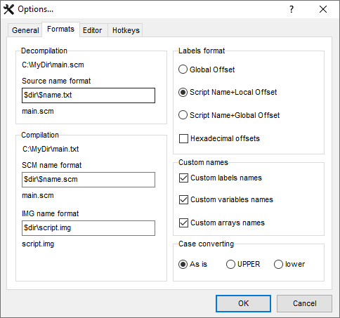
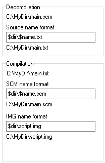
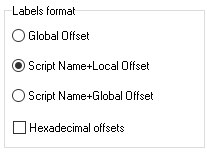
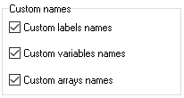

# Formats

Here you can set up source file names, labels format, letter case for string literals, etc.

## File Name Format

Formats for files produced by the disassembler or the compiler.

The top field contains the full path and name of a text file created during disassembling. Two fields below contain the path and the name of binary files `SCM` and `IMG` (if the [edit mode](../../edit-modes/) is `GTA SA`) created during compilation. All fields share the same syntax. They also may use special words representing parts of the source file name:

`$dir` – the file path \
`$name` – the file name \
`$ext` – the file extension

E.g. if you disassemble the file `C:\MyDir\main.scm`, then

`$dir` is `C:\MyDir` \
`$name` is `main` \
`$ext` is `.scm`&#x20;

If the format is `$dir\$name.txt`, the output file is named `C:\MyDir\main.txt`.

## Label Name Format

Formats for label names used during disassembling.

### Global Offset

A label name is numeric e.g. `@12345`. The number is the offset of the label from the beginning of the source file.

### Script+Local Offset

A label name includes a name of the script where the label is located (as defined with the `script_name` command) and the offset from the beginning of the script, e.g. `@MAIN_12`.

### Script+Global Offset

A label name includes a name of the script where the label is located (as defined with the `name_thread` command) and the offset from the beginning of the source file, e.g. `@MAIN_12345`.


If you want the offsets to be hexadecimal, select the checkbox at the bottom.


## Custom Names

These options instruct the disassembler to use custom names defined by the user in the external files.

The file [`CustomLabels.ini`](../../edit-modes/customlabels.ini.md) contains the list of label names and their offsets. If the disassembler finds a match between the label offset in the source file and the offset defined in the INI file it gives this label a name associated with this offset.

The file `CustomVariables.ini` contains the list of [global variables](../../coding/variables.md#global-variables) addresses and their custom names. The disassembler uses this file to name global variables.

The file `CustomArrays.ini` contains names of the arrays in the following syntax: the first number is the global variable address which is the first element of the array, then the array size, then a custom name. It helps the disassembler to recognize [array elements](../../coding/arrays.md#using-constant-indexes).

## Case Converting

This option serves a dual purpose. The disassembler names [global variables](../../coding/variables.md#global-variables), [labels](../../coding/data-types.md#labels), [arrays](../../coding/arrays.md) using the selected letter case. The compiler writes [string literals](../../coding/data-types.md#string-literals) using the selected case too.
