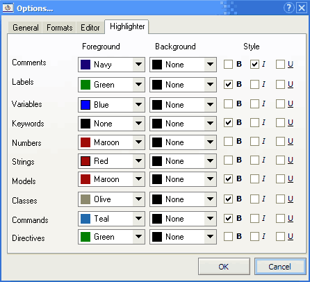

# Syntax Highlighting

These settings customize the way Sanny Builder displays various elements of the code. 

Each code element has 3 properties: `Foreground`, `Background`, and `Style`.   
Available `style` elements are: **B** – bold, **I** – italic, **U** – underlined.

The highlighting configuration is also used when the code source is saved into the `RTF` or `HTML` formats.

### Code elements

* [Comments](../../features.md#commenting-code) – the text after `//` or between `{}` or `/* */`
* [Labels](../../coding/data-types.md) – the identifiers starting with `@`
* [Variables](../../coding/variables.md) – the identifiers starting with `$` \(global variables\), or ending with `@` \(local variables\) Also the [aDMA](../../coding/data-types.md) type \(begins with `&`\) and [arrays](../../coding/arrays.md) are highlighted as variables.
* [Keywords](../../coding/keywords.md) – the special words stored in the file `keywords.ini` \(one for all [edit modes](../../edit-modes.md)\) and the file`keywords.txt` \(one per edit mode\)
* Numbers – the integer and floating-point numbers
* Strings – the text between double quotes `" "` and single quotes `' '`
* Models – the identifiers starting with `#`
* [Classes](../../coding/classes.md) – the part of the class command before the `.` character
* [Commands](../../coding/classes.md) – the part of the class command after the `.` character
* [Directives ](../../coding/directives.md)– the text starting with `{$`

