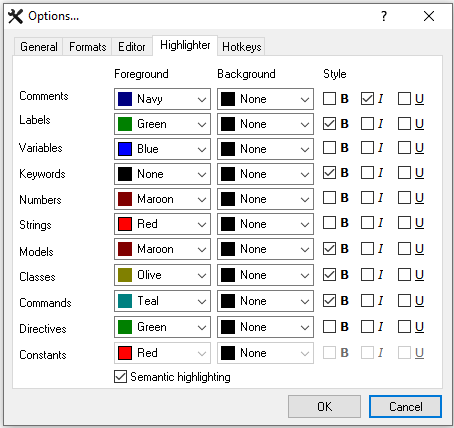

# Syntax Highlighting

These settings customize the way Sanny Builder displays various elements of the code. 

Each code element has 3 properties: `Foreground`, `Background`, and `Style`.   
Available `style` elements are: **B** – bold, **I** – italic, **U** – underlined.

The highlighting configuration is also used when the code source is saved into the `RTF` or `HTML` formats.

### Code elements

* [Comments](../features.md#commenting-code) – a text after `//` or between `{}` or `/* */`
* [Labels](../coding/data-types.md) – identifiers starting with `@`
* [Variables](../coding/variables.md) – identifiers starting with `$` \(global variables\), or ending with `@` \(local variables\) Also the [aDMA](../coding/data-types.md) type \(starts with `&`\) and [arrays](../coding/arrays.md) are highlighted as variables.
* [Keywords](../coding/keywords.md) – the special words stored in the file `keywords.ini` \(one for all [edit modes](../edit-modes/)\) and a file`keywords.txt` \(one per edit mode\)
* Numbers – integer and floating-point numbers
* Strings – a text between double quotes `" "` or single quotes `' '`
* Models – identifiers starting with `#`
* [Classes](../coding/classes.md) – the part of a class command before the `.` character
* [Commands](../coding/classes.md) – the part of a class command after the `.` character, or a [subroutine](../coding/data-types.md#labels)
* [Directives ](../coding/directives.md)– a command starting with `{$`
* [Constants](../coding/constants.md) – identifiers, declared within the `CONST..END` construct. The [language service](../language-service.md) must be enabled.
  * `Semantic highlighting` - apply the same rules to constants as to their values. Enabling this option makes shared highlighting configuration unavailable.

